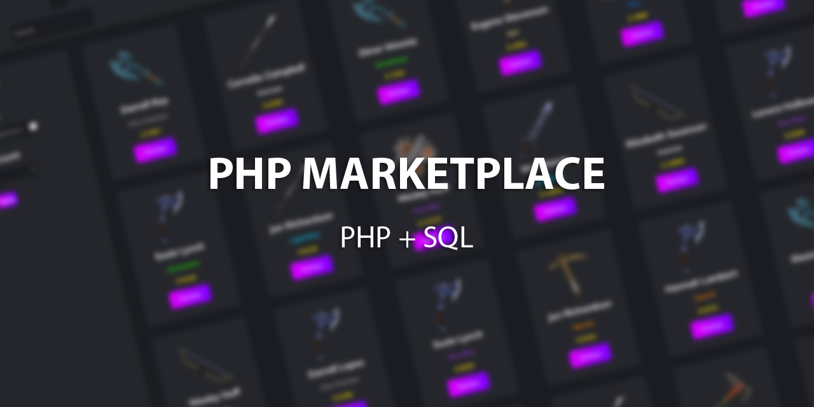
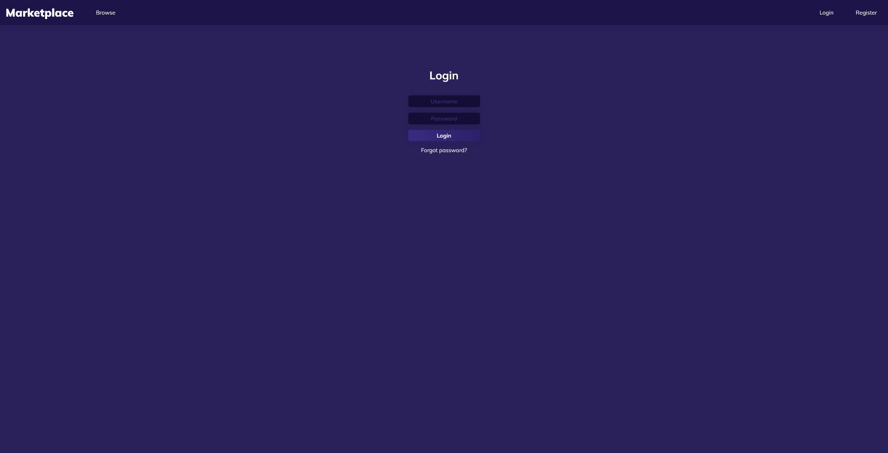
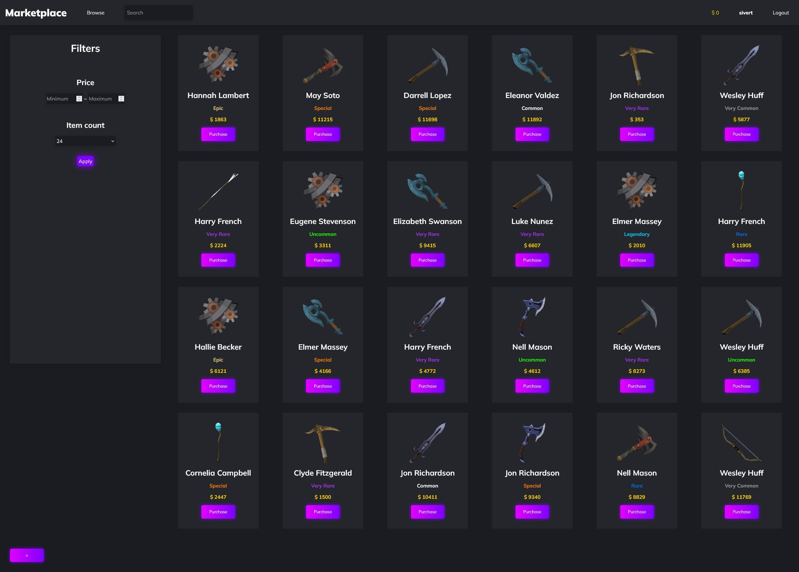

  
   
   
  
  
  
  
   
  <h1>Php Marketplace</h1>
  <h2>PHP + MYSQL</h2>
   
  <h3>Index:</h3>
  <ol align='left'>
  <li><a href='https://github.com/SivertGullbergHansen/phpMarketPlace#screenshots'>Screenshots</a></li>
  <li><a href='https://github.com/SivertGullbergHansen/phpMarketPlace#description'>Description</a>
  <ol>
  <li><a href='https://github.com/SivertGullbergHansen/phpMarketPlace#about-the-project'>About the Project</a></li>
  <li><a href='https://github.com/SivertGullbergHansen/phpMarketPlace#about-the-marketplace'>About the Marketplace</a></li>
  <li><a href='https://github.com/SivertGullbergHansen/phpMarketPlace#features'>Features</a></li>
  <li><a href='https://github.com/SivertGullbergHansen/phpMarketPlace#requirements'>Requirements</a></li>
  <li><a href='https://github.com/SivertGullbergHansen/phpMarketPlace#recommendations'>Recommendations</a></li>
  <li><a href='https://github.com/SivertGullbergHansen/phpMarketPlace#colours'>Colours</a></li>
  </ol>
  </li>
  </ol>
   
  <h2>Screenshots</h2>
  
  

 

  <h2>Description</h3>
  <h3>About the project</h3>
  
<i>This project is meant to be used as a template for when you wish to integrate a marketplace into your service or game. It is made to be open-source and free to use by everyone. Check the <a href=''>license</a> if you wish to use this commercially.</i>
  
  The project has been built in conjunction with <b>PHP Version 8.0.7</b>. It should be supported by older versions of PHP, however I urge you to use the same or newer version of PHP.
  
  The project was also built in conjunction with <b>Apache 2.4.48</b>.

  
   

  <h2>About the marketplace</h2>
  
This is a marketplace where users can register an account to sell items and buy listed items from other players. 
  
  It does not feature any commercial payments, as it is made with the purpose to serve as a template. The currency users have in their account is completely fictional and is registered in the server's database.

  
   
  
  <h2>Features</h2>
  <ul>
    <li>Login (MYSQL) :white_check_mark:</li>
    <li>Register (MYSQL) :white_check_mark:</li>
    <li>Dynamic item-grid :white_check_mark:</li>
    <li>Hashed session (MYSQL)</li>
    <li>Load items (MYSQL)</li>
    <li>Filter by price</li>
    <li>Filter by collection</li>
    <li>Filter by colour</li>
    <li>Filter by type</li>
    <li>Purchase item</li>
    <li>Sell item</li>
    <li>View inventory</li>
    <li>Manage account</li>
    <li>Change password</li>
    <li>Search function</li>
  </ul>
   
  
  <h2>Requirements</h1>
  <ol>
    <li>Apache Server (with PHP v8.0.7)</li>
    <li>A configured MySQL server</li>
    <li><i>(optional)</i> PHPMyAdmin</li>
  </ol>
   

  <h2>Recommendations</h1>
    
It is recommended that you use a PHP development environment such as <a href='https://www.apachefriends.org/download.html'>XAMPP</a> to run the project locally. Select the latest version of XAMPP to receive the latest PHP version (version 8+)

   
  
  <h2>Colours</h2>
  <ul>
  <li>Background
    <ul>
  <li> 1b1c21</li>
    </ul>
      </li>
     
  <li>Header
    <ul>
  <li> 25262b</li>
    </ul>
      </li>
     
  <li>Accent
    <ul>
  <li> fefefe</li>
    </ul>
      </li>
     
  <li>Buttons
    <ul>
    Active button
  <li> E100FF</li>
  <li> 7F00FF</li>
   
  Disabled button
  <li> 24243e</li>
  <li> 302b63</li>
    </ul>
      </li>
     
  <li>Currency
    <ul>
  <li> ffd700</li>
    </ul>
      </li>
       
      <li>Rarities
    <ul>
    Very Common
  <li> 9d9d9d</li>
   
    Common
  <li> ffffff</li>
   
    Uncommon
  <li> 1eff00</li>
   
    Rare
  <li> 0070dd</li>
   
    Very Rare
  <li> a335ee</li>
   
    Special
  <li> ff8000</li>
   
    Epic
  <li> e6cc80</li>
   
    Legendary
  <li> 00ccff</li>
   
    </ul>
      </li>
  </ul>
      </li>
  </ul>

   
  
  <h2>Fonts</h2>
  <a href="https://fonts.google.com/share?selection.family=Mulish:ital,wght@0,200;0,300;0,400;0,500;0,600;0,700;0,800;0,900;1,200;1,300;1,400;1,500;1,600;1,700;1,800;1,900">Google Fonts: Mulish</a>
